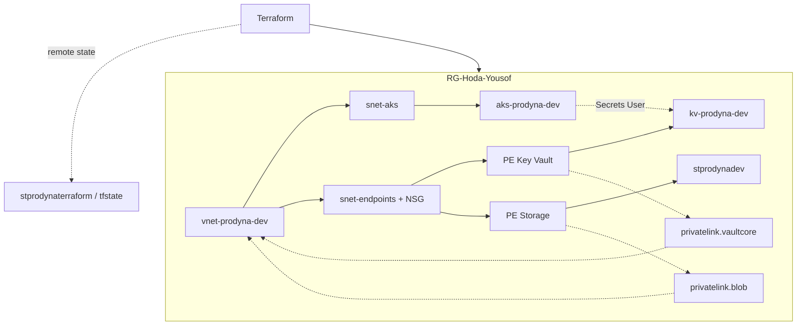

# PRODYNA Praxisaufgabe – DevOps / Azure

Terraform-Umgebung mit privatem Networking, AKS, Key Vault und Storage.  
**Rolle:** DevOps Engineer (Variante A) · **Status:** in `RG-Hoda-Yousof` deployed.

---

## Overview

- VNet mit AKS- und Private-Endpoint-Subnet (+ NSG)
- AKS (1 Node), Key Vault, Storage Account
- Private Endpoints + Private DNS + RBAC
- Remote State, Module-Struktur, Helm-Chart, GitHub Actions CI

---

## Prerequisites

- Azure CLI (Login in die Candidate-Subscription)
- Terraform >= 1.5
- Bestehende RG: `RG-Hoda-Yousof` (keine Rechte für neue RGs)
- State-Backend: `stprodynaterraform` / `tfstate` / `prodyna-dev.tfstate`

---

## Project structure

```text
.
├── bootstrap/              # Einmalig: State-Storage (local backend)
├── infrastructure/         # Haupt-Stack (remote state)
│   ├── main.tf             # Module + RBAC
│   ├── backend.tf / providers.tf
│   ├── moved.tf            # Migration flat → modules (kann bleiben)
│   ├── terraform.tfvars.example
│   └── modules/
│       ├── network/
│       ├── keyvault/
│       ├── storage/
│       ├── aks/
│       └── private-endpoints/
├── helm/nginx/             # Staging / Production Values
├── .github/workflows/      # CI (validate); CD manuell + OIDC (Konzept)
└── README.md
```

---

## How to deploy

```bash
# Backend einmalig (bereits erledigt)
cd bootstrap && cp terraform.tfvars.example terraform.tfvars
terraform init && terraform apply && cd ..

# Infrastruktur
cd infrastructure
cp terraform.tfvars.example terraform.tfvars   # anpassen
az login && az account show
terraform init && terraform plan && terraform apply
```

AKS-Zugang:

```bash
az aks get-credentials -g RG-Hoda-Yousof -n aks-prodyna-dev
kubectl get nodes
```

Destroy (Kosten): `cd infrastructure && terraform destroy`  
State-Storage (Bootstrap) wird dabei nicht gelöscht.

---

## Design decisions

| Entscheidung | Warum |
|---|---|
| RG per `data` | Keine `resourcegroups/write`; vorgegebene RG |
| Zwei Subnets | Compute vs. Private Endpoints (+ NSG) |
| Remote State | Locking, Team, State enthält sensible Daten |
| PE + Private DNS | PE = Tür (private IP); DNS = Telefonbuch (Name → private IP) |
| RBAC | AKS = *Secrets User*; Deploy-User = *Administrator*; keine Secrets im Code |
| `Standard_B2s_v2` | `B2s` in Sub/Region nicht erlaubt |
| Service-CIDR `172.16.0.0/16` | Darf nicht mit VNet `10.0.0.0/16` überlappen |
| Module | Wiederverwendung; Staging/Prod über tfvars + eigene State-Keys |

---

## Architecture



---

## CI / CD

| Workflow | Zweck |
|---|---|
| `ci.yaml` | Bei Push/PR: `terraform fmt/validate` + `helm lint/template` |
| `cd.yaml` | Manuell: `terraform apply` + Helm Deploy (braucht Azure OIDC Secrets) |

CD ist vorbereitet. App Registration / Federated Credential war in der Candidate-Umgebung nicht anlegbar — im Interview als Constraint erklärbar. CI läuft ohne Azure-Login.

---

## Variante A

### Helm (nginx)

Chart unter `helm/nginx/`: Defaults in `values.yaml`, Overrides in `values-staging.yaml` / `values-production.yaml` (Namespace, Replicas, Resources, RollingUpdate).  
Production: HPA an (min 2 / max 5, CPU 70%); Staging: HPA aus, feste Replica.

### Secret Sync (Konzept)

External Secrets Operator (oder CSI): Key Vault → K8s Secret → App (Env/Volume). Auth über AKS Managed Identity (*Secrets User* bereits gesetzt). Klartext nie im Git.

---

## Demo checklist

- Portal: Ressourcen in `RG-Hoda-Yousof`
- `cd infrastructure && terraform plan` (möglichst clean)
- PE / DNS / RBAC erklären
- Modul-Struktur + CI kurz zeigen
- Variante A: Helm-Values + Secret-Sync-Fluss
