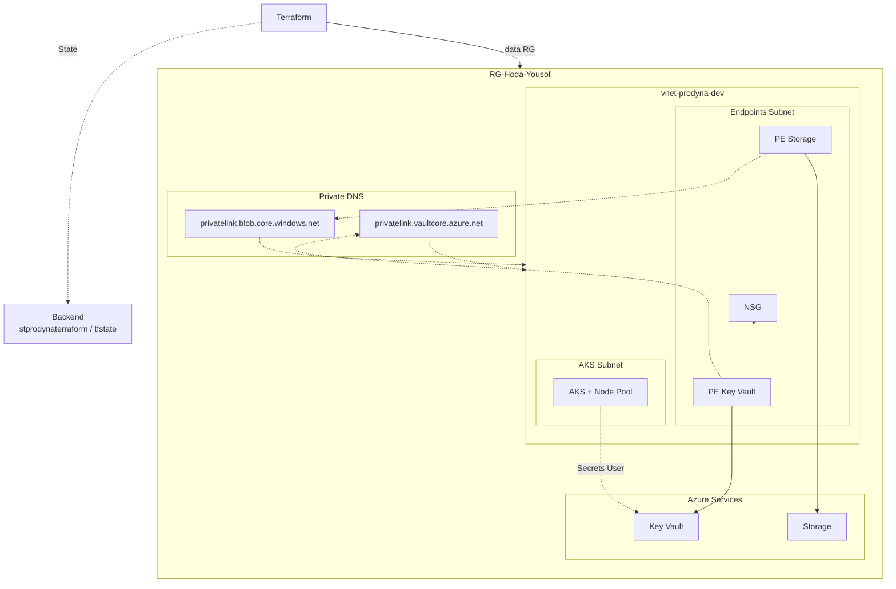

# PRODYNA Praxisaufgabe – DevOps / Azure

Terraform-Projekt für eine kleine Azure-Umgebung mit privatem Networking, AKS, Key Vault und Storage.

**Rolle:** DevOps Engineer (Variante A – Konzept)  
**Status:** In der Candidate-Subscription deployed und live vorzeigbar.

---

## Overview

Das Projekt stellt per Terraform bereit:

- VNet mit getrennten Subnets (AKS + Private Endpoints) und NSG
- AKS (1 Node)
- Key Vault + Storage Account
- Private Endpoints, Private DNS Zones, RBAC
- Remote State in Azure Storage

---

## Prerequisites

- Azure CLI + Login in die PRODYNA-Subscription
- Terraform >= 1.5
- Bestehende Resource Group: `RG-Hoda-Yousof` (keine Rechte zum Anlegen neuer RGs)
- State-Backend einmalig angelegt: Storage `stprodynaterraform`, Container `tfstate`, Key `prodyna-dev.tfstate`

---

## Project structure

```text
.
├── main.tf                   # Provider, Backend, Azure-Ressourcen
├── variables.tf              # Eingabevariablen
├── terraform.tfvars.example  # Beispielwerte (echte tfvars ist gitignored)
├── outputs.tf                # Ausgaben nach dem Apply
├── .gitignore
├── .terraform.lock.hcl
└── README.md
```

Flache Struktur bewusst für den Aufgabenumfang. Mögliche Module siehe unten.

---

## How to deploy

```bash
cp terraform.tfvars.example terraform.tfvars   # Werte anpassen
az login && az account show

terraform init
terraform plan
terraform apply
terraform output
```

Optional AKS:

```bash
az aks get-credentials --resource-group RG-Hoda-Yousof --name aks-prodyna-dev
kubectl get nodes
```

Destroy (Kosten): `terraform destroy`  
Hinweis: Der State-Storage wird vom Projekt nicht mitgelöscht.

---

## Design decisions

| Entscheidung | Warum |
|---|---|
| `data` statt `resource` für die RG | Keine `resourcegroups/write`-Rechte; vorgegebene RG nutzen |
| Zwei Subnets | AKS (Compute) getrennt von Private Endpoints (+ NSG) |
| Remote State | Locking, Collaboration, State enthält sensible Daten; Backend muss vor `init` existieren |
| Private Endpoint + DNS | Endpoint = private Tür; DNS = Name → private IP |
| RBAC | AKS Identity = *Key Vault Secrets User*; Terraform-User = *Administrator*; keine Secrets im Code |
| AKS `Standard_B2s_v2` | `Standard_B2s` in dieser Subscription/Region nicht erlaubt |
| Service-CIDR `172.16.0.0/16` | Darf nicht mit VNet `10.0.0.0/16` überlappen |

Terraform verbindet Ressourcen über Referenzen (z. B. `azurerm_subnet.endpoints.id`), nicht über hartcodierte IDs — daraus entsteht der Dependency Graph.

---

## Modul-Aufteilung

Aktuell flach in `main.tf`. Für Skalierung sinnvoll:

| Modul | Inhalt |
|---|---|
| `modules/network` | VNet, Subnets, NSG |
| `modules/aks` | Cluster + Node Pool |
| `modules/keyvault` | Key Vault + PE + DNS |
| `modules/storage` | Storage + PE + DNS |
| `modules/rbac` | Role Assignments |

Vorteil: Wiederverwendung und Staging/Prod über dieselben Module + unterschiedliche `tfvars`.

---

## Architecture

Private Erreichbarkeit: AKS im eigenen Subnet; Key Vault/Storage über Private Endpoints im Endpoints-Subnet; Private DNS löst Hostnames auf private IPs auf.



**Kurzfluss DNS:** Name → Private DNS Zone → private IP → Private Endpoint → Service.  
**RBAC:** Netzwerkpfad und Berechtigung sind getrennt (PE/DNS vs. Role Assignment).

---

## Variante A – Konzept (DevOps)

> Konzeptbeschreibung laut Aufgabe — nicht zwingend implementiert.

### 1) nginx Deployment + Service (Staging / Production)

IaC im Repo (Kustomize-Overlays oder Helm-Values pro Stage):

- `Deployment` (`nginx:stable`), `Service` (ClusterIP / Ingress)
- Namespaces `staging` / `production`
- Staging: 1 Replica; Production: >= 2, Requests/Limits, immutable Image-Tags, TLS empfohlen
- Pipeline-Idee: GitHub Actions → `kubectl`/`helm` nach Login via OIDC/Service Principal (keine Dauer-Secrets im Repo)

### 2) Secret Sync Key Vault → Cluster

**External Secrets Operator** (oder Secrets Store CSI Driver):

1. Operator installieren  
2. `SecretStore` auf Key Vault  
3. Auth über AKS Managed Identity / Workload Identity (Rolle *Key Vault Secrets User* bereits vorhanden)  
4. `ExternalSecret` mappt KV-Secret → Kubernetes Secret  
5. App nutzt Env/Volume; Sync läuft periodisch, Rotation möglich  

Kein Klartext im Git — nur Declarative CRs, Werte bleiben im Vault.

---

## Demo checklist

- Portal: Ressourcen in `RG-Hoda-Yousof` zeigen  
- `terraform plan` (sollte clean / minimal sein)  
- Erklären: Endpoint = Tür, DNS = Telefonbuch, RBAC = Erlaubnis  
